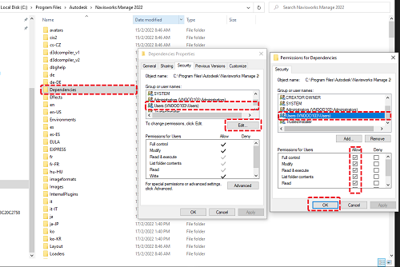
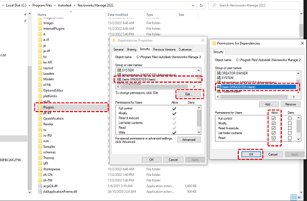

# NavisPythonShell


This is obviously a fork of [RevitPythonShell](https://github.com/architecture-building-systems/revitpythonshell), bringing an IronPython interpreter to Autodesk Navisworks, and it would not be possible without the great work of everyone involved with the RPS project. It's still pretty rough around the edges and provides only basic functionality at this time. I'm sharing my work so far, in the hopes that together we can expand it further.

The NavisPythonShell (NPS) ~lets you to write plugins for Navisworks in Python,~ provides you with an interactive shell that lets you see the results of your code *as you type it*. This is great for exploring the Navis API.

The biggest limitation is that you can't deploy DLLs with custom scripts at this time and you can't subscribe to events at startup time. NPS currently executes as a standard plugin, mainly because of the way Navisworks' EventPlugin plugin types work. While in Revit startup happens after all dependencies have been loaded, EventPlugins in Navisworks try to start as soon as possible, without preloading their dependancies. A startup script will still execute, but only after everything else has been loaded.

## Features

- interactive IronPython interpreter for exploring the API
  - with syntax highlighting and autocompletion (in the console only)
  - based on the [IronLab](http://code.google.com/p/ironlab/) project
- batteries included! (Python standard library is bundled as a resource in the `RpsRuntime.dll`)
- full access to the .NET framework and the Navis API
- configurable "environment" variables that can be used in your scripts
- save "external scripts" for reuse and start collecting your awesome hacks!
- run scripts at Navisworks startup
- ~deploy scripts as standalone Navisworks Addins~

## Installation

- Reference the version of "Autodesk.Navisworks.Api.dll" that you'd like to target.
- Compile the solution.
- Go to the "C:\Program Files\Autodesk\Navisworks Manage {version}\Plugins" (with version being the current version of your navisworks)
    - If there is no "Plugins" foler, create it
    - Change Permisstions of two folder `Plugins` and `Dependencies` in properties

    

    

    - Build Solution(if you change `version` of navisworks, please change number version in post build event)
    ```
    xcopy $(TargetDir)*.* "C:\Program Files\Autodesk\Navisworks Manage {version}\Plugins\NavisPythonShell\" /Y /I /E /EXCLUDE:$(SolutionDir)exclude.txt

    xcopy $(TargetDir)*.* "C:\Program Files\Autodesk\Navisworks Manage {version}\Dependencies\" /Y /I /E /EXCLUDE:$(SolutionDir)noexclude.txt
    
    ```

OR

- Download a valid [release zip](https://github.com/dimven/NavisPythonShell/releases) for your `version` of Navisworks.
- Extract the zip to two folder: 
  - "C:\Program Files\Autodesk\Autodesk Navisworks Manage {version}\Plugins" : include all file in noexclude.txt and folder icon
  - "C:\Program Files\Autodesk\Autodesk Navisworks Manage {version}\Dependencies" : include all file in exclude.txt

## Contribute

- Don't hesitate to file any issues you stumble uppon. (Tho I don't guarantee I'll be able to solve them all for you)

## Getting started:

Learn some python:

  * [The Python Tutorial](https://docs.python.org/2/tutorial/)
  * [Dive Into Python](http://www.diveintopython.net/)

Learn about the Navisworks API:

  * [Autodesk Developer Network](T)
  * [The Navisworks SDK"](http://usa.autodesk.com/adsk/servlet/index?id=15024694&siteID=123112)
   

## License

This project is licensed under the terms of the [MIT License](http://opensource.org/licenses/MIT).

## Credits

  * Daren Thomas (original RPS Developer) [RPS] (https://github.com/architecture-building-systems/revitpythonshell)
  * Joe Moorhouse (interactive shell was taken from his project [IronLab](http://ironlab.net/))
  * Dimitar Venkov (original port to Navisworks)
  * The rest of the RPS contributors
